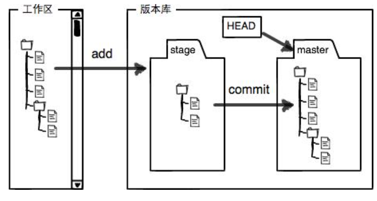

[TOC]


## 时光机穿梭

### 工作区和暂存区

#### 版本库（Repository）

工作区有一个隐藏目录`.git`，这个不算工作区，而是Git的版本库。

Git的版本库里存了很多东西，其中最重要的就是称为stage（或者叫index）的暂存区，还有Git为我们自动创建的第一个分支`master`，以及指向`master`的一个指针叫`HEAD`。



### 删除文件

删除工作区文件（本地目录）

```git
 rm test.txt
```

在删除暂存区(版本库)文件

```git
$ git rm test.txt
```

恢复

```git
$ git checkout -- test.txt
```

## 远程仓库

第1步：创建SSH Key。在工作区打开git bash

```git
$ ssh-keygen -t rsa -C "youremail@example.com"
```

如果一切顺利的话，可以在用户主目录里找到`.ssh`目录，里面有`id_rsa`和`id_rsa.pub`两个文件，这两个就是SSH Key的秘钥对，`id_rsa`是私钥，不能泄露出去，`id_rsa.pub`是公钥，可以放心地告诉任何人。


第2步：登陆GitHub，打开“Account settings”，“SSH Keys”页面：

然后，点“Add SSH Key”，填上任意Title，在Key文本框里粘贴`id_rsa.pub`文件的内容：

 

点“Add Key”，你就应该看到已经添加的Key：


### 添加远程仓库

推送到github远程仓库。

```git
$ git remote add origin git@github.com:michaelliao/learngit.git
```

请千万注意，把上面的`michaelliao`替换成你自己的GitHub账户名，否则，你在本地关联的就是我的远程库，关联没有问题，但是你以后推送是推不上去的，因为你的SSH Key公钥不在我的账户列表中。

添加后，远程库的名字就是`origin`，这是Git默认的叫法，也可以改成别的，但是`origin`这个名字一看就知道是远程库。

下一步，就可以把本地库的所有内容推送到远程库上：

#### 第一次推送master分支的所有内容。

```git
$ git push -u origin master
Counting objects: 20, done.
Delta compression using up to 4 threads.
Compressing objects: 100% (15/15), done.
Writing objects: 100% (20/20), 1.64 KiB | 560.00 KiB/s, done.
Total 20 (delta 5), reused 0 (delta 0)
remote: Resolving deltas: 100% (5/5), done.
To github.com:michaelliao/learngit.git
 * [new branch]      master -> master
Branch 'master' set up to track remote branch 'master' from 'origin'.
```

把本地库的内容推送到远程，用`git push`命令，实际上是把当前分支`master`推送到远程。

由于远程库是空的，我们第一次推送`master`分支时，加上了`-u`参数，Git不但会把本地的`master`分支内容推送的远程新的`master`分支，还会把本地的`master`分支和远程的`master`分支关联起来，在以后的推送或者拉取时就可以简化命令。

#### 推送最新修改。从现在起，只要本地作了提交，就可以通过命令：

```git
$ git push origin master
```

把本地`master`分支的最新修改推送至GitHub，现在，你就拥有了真正的分布式版本库！


### 从远程仓库克隆

现在，远程库已经准备好了，下一步是用命令`git clone`克隆一个本地库：

```git
$ git clone git@github.com:michaelliao/gitskills.git
Cloning into 'gitskills'...
remote: Counting objects: 3, done.
remote: Total 3 (delta 0), reused 0 (delta 0), pack-reused 3
Receiving objects: 100% (3/3), done.
```

注意把Git库的地址换成你自己的，然后进入`gitskills`目录看看，已经有`README.md`文件了：

```git
$ cd gitskills
$ ls
README.md
```


## 分支管理

### 创建与合并分支

查看分支：`git branch`

创建分支：`git branch <name>`

切换分支：`git checkout <name>`或者`git switch <name>`

创建+切换分支：`git checkout -b <name>`或者`git switch -c <name>`

合并某分支到当前分支：`git merge <name>`

删除分支：`git branch -d <name>`


### 解决冲突

#### 删除分支

```git
一个分支
git branch -D branchName
删除很多分支，比如除了master外的所有分支：

// 切换到master分支
git checkout master

git branch | grep -v 'master' | xargs git branch -D

1. git branch 查看本地所有分支
2. grep -v 'master' 过滤除了master的所有分支名称
3. xargs git branch -D 将处理后的结果作为git branch -D的参数来进行删除分支
```
```


#### 合并分支发生冲突

```git
$ git merge feature1
Auto-merging readme.txt
CONFLICT (content): Merge conflict in readme.txt
Automatic merge failed; fix conflicts and then commit the result.
```

`git status`也可以告诉我们冲突的文件：

```git
$ git status
On branch master
Your branch is ahead of 'origin/master' by 2 commits.
  (use "git push" to publish your local commits)

You have unmerged paths.
  (fix conflicts and run "git commit")
  (use "git merge --abort" to abort the merge)

Unmerged paths:
  (use "git add <file>..." to mark resolution)

    both modified:   readme.txt

no changes added to commit (use "git add" and/or "git commit -a")
```

#### 直接打开文件内容

我们可以直接查看readme.txt的内容：

```git
Git is a distributed version control system.
Git is free software distributed under the GPL.
Git has a mutable index called stage.
Git tracks changes of files.
<<<<<<< HEAD
Creating a new branch is quick & simple.
=======
Creating a new branch is quick AND simple.
>>>>>>> feature1
```

Git用`<<<<<<<`，`=======`，`>>>>>>>`标记出不同分支的内容，我们修改如下后保存：

```
Creating a new branch is quick and simple.
```

再提交：

```
$ git add readme.txt 
$ git commit -m "conflict fixed"
[master cf810e4] conflict fixed
```

#### 用带参数的`git log`也可以看到分支的合并情况：

```
$ git log --graph --pretty=oneline --abbrev-commit
```


### 分支管理策略

**英文状态下按q ,即可退出git log**


